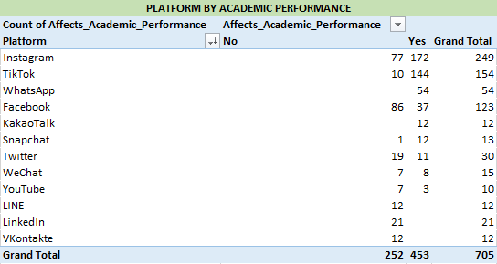
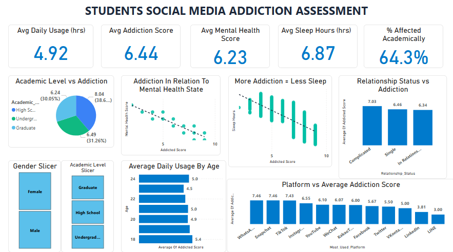
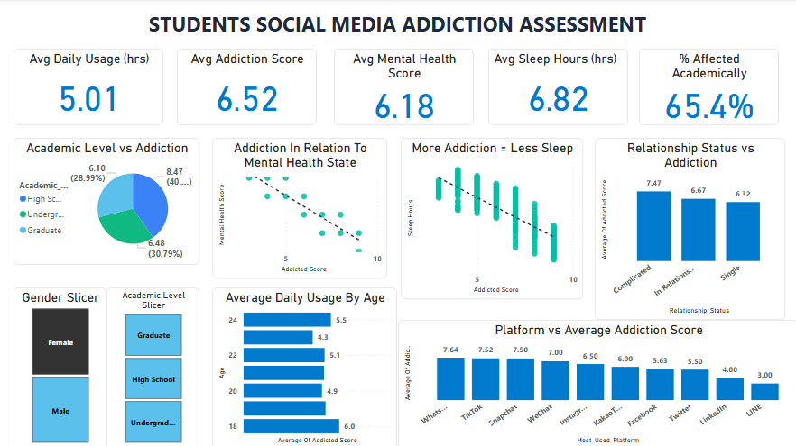
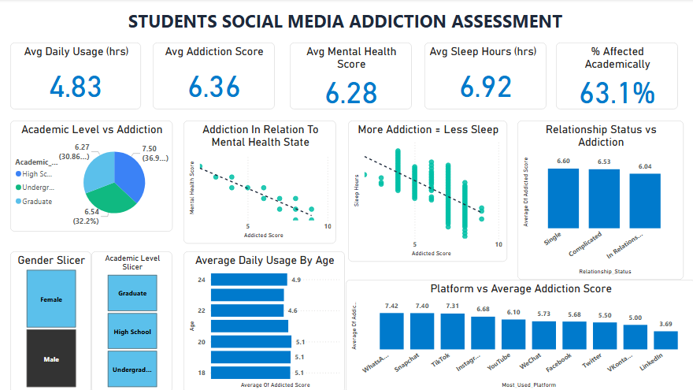

# STUDENT SOCIAL MEDIA ADDICTION ANALYSIS  

**Tools Used:**  
- Python (Jupyter Notebook)  
- Excel  
- SQL  
- Power BI  

---

## 📋 Project Overview  
This project explores the relationship between students’ social media usage and its impact on **sleep, academic performance, and mental health**.  
It seeks to understand how digital habits influence overall wellbeing and learning outcomes using a real-world-style student survey dataset.

---

## 🎯 Objectives / Key Questions  
1. Which social media platforms affect students’ academics the most?  
2. What is the average daily social media usage among students?  
3. What are the average levels of addiction, sleep, and mental health?  
4. How does academic level influence social media addiction?  
5. How does relationship status affect addiction levels?  
6. Which platforms are most associated with higher addiction scores?  
7. What percentage of students believe social media affects their academic performance?  
8. Which gender shows higher average addiction or daily usage?  

---

## 🧩 Data Description  

| Column | Description |
|---------|--------------|
| Student_ID | Unique student identifier |
| Age | Student’s age |
| Gender | Male / Female |
| Academic_Level | Education level (e.g., Undergraduate, Graduate) |
| Country | Student’s country |
| Avg_Daily_Usage_Hours | Average daily social media usage (in hours) |
| Most_Used_Platform | Platform used most frequently |
| Affects_Academic_Performance | Indicates whether social media affects academics (Yes/No) |
| Sleep_Hours_Per_Night | Average sleep duration per night |
| Mental_Health_Score | Scale from 4–8 (higher = better mental health) |
| Relationship_Status | Relationship situation (Single, Complicated, In a Relationship) |
| Conflicts_Over_Social_Media | Number of conflicts caused by social media |
| Addicted_Score | Composite score representing addiction level |

---

## 🧮 Data Cleaning & Exploration  
- Cleaned missing and inconsistent values in **Excel**.  
- Conducted **Exploratory Data Analysis (EDA)** in Python using `pandas`, `matplotlib`, and `seaborn`.  
- Validated trends and relationships using **SQL** queries.  
- Built KPIs and interactive visuals using **Power BI**.

---

## 📊 Key Findings  

### Q1. Which social media platforms affect academics the most?  
Instagram usage shows the strongest negative impact on academic performance (172 “Yes” responses), followed by TikTok (144 “Yes”).  
  

---

### Q2–Q7. Behavioral and Academic Patterns  

**Key insights from the Power BI dashboard:**  
- **Avg Daily Usage:** 4.92 hours per student.  
- **Avg Addiction Score:** 6.44 (moderate–high addiction).  
- **Avg Mental Health Score:** 6.23 (slightly below healthy threshold).  
- **Avg Sleep Hours:** 6.87 hours per night.  
- **Academic Impact:** 64.3% of students believe social media negatively affects their academic performance. I got this using the DAX function:
```DAX
% Affected Academically = 
FORMAT(
    DIVIDE(
        COUNTROWS(FILTER(Students_Social_Media_Addiction, Students_Social_Media_Addiction[Affects_Academic_Performance] = "Yes")),
        COUNTROWS(Students_Social_Media_Addiction), 0),
        "0.0%"
)
```
**Additional Observations:**  
- High school students show the highest addiction score (7.50), followed by undergraduates (6.54).  
- Single students exhibit the highest addiction levels (6.60), while those in relationships report slightly lower scores (6.04).  
- WhatsApp users have the highest average addiction score (7.42).  

#### DASHBOARD IMAGE
  
---

### Q8. Gender Differences in Addiction  

Addiction tendencies are generally higher among **female students**.  
Male students tend to have slightly higher **average sleep hours** and **mental health scores**, indicating lower addiction effects overall.  

#### FEMALE SLICER EFFECT ON DASHBOARD
  
#### MALE SLICER EFFECT ON DASHBOARD
  

---

## Summary of Key Insights  
- Students spend an average of **nearly 5 hours per day** on social media, with high levels of dependency.  
- **Over 64%** report a negative academic impact linked to social media.  
- There’s a **negative correlation** between addiction and both sleep hours and mental health.  
- **High school and single students** show the highest addiction levels.  
- **Females** exhibit slightly higher addiction patterns, though **males** display better sleep and mental health balance.  
- **WhatsApp and Instagram** are the top contributors to high addiction scores.  

---

## 👩🏽‍💻 Author  
**Ipadeola Itunu**  
_Data Analyst | Power BI | SQL | Python | Excel_  
